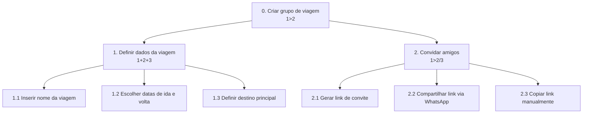
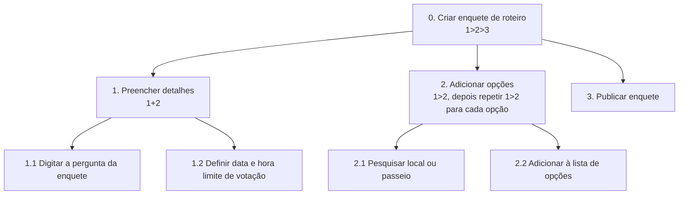

# Análise de Tarefas

A Análise de Tarefas a seguir detalha como os usuários interagem com o aplicativo **FEI Viagens** para resolver seus principais problemas de organização e divisão de custos. Foram modeladas 4 funcionalidades principais, utilizando os métodos HTA e GOMS.

---

## 1) HTA (Hierarchical Task Analysis)

### HTA 1 — Criar um grupo de viagem
**Funcionalidade:** Permitir que o Líder Organizador (ex: Maria Clara) crie o ambiente do projeto da viagem, defina as datas e envie o convite para os demais participantes entrarem no grupo.



**Plano de Execução:**
- **Plano 0 (`1>2`):** Primeiro o usuário define os dados da viagem, depois convida os amigos.
- **Plano 1 (`1+2+3`):** O nome, as datas e o destino são preenchidos no mesmo formulário de criação, de forma simultânea (em qualquer ordem).
- **Plano 2 (`1>2/3`):** O usuário deve gerar o link primeiro e, em seguida, escolher apenas uma alternativa: ou compartilha direto pelo WhatsApp ou copia o link manualmente.

### HTA 2 — Criar uma enquete de roteiro
**Funcionalidade:** Permitir que qualquer membro do grupo crie uma votação rápida (com prazo limite) para decidir democraticamente sobre um passeio ou escolha de hospedagem.



**Plano de Execução:**
- **Plano 0 (`1>2>3`):** O usuário preenche os detalhes da pergunta, depois adiciona as opções disponíveis para voto e, por fim, publica a enquete no grupo.
- **Plano 1 (`1+2`):** A digitação da pergunta e a configuração da data limite ocorrem na mesma tela, sem ordem estrita.
- **Plano 2 (`Repetição`):** O usuário deve pesquisar um local e adicioná-lo. O processo se repete até que todas as opções da enquete tenham sido inseridas.

---

## 2) GOMS (Goals, Operators, Methods, Selection Rules)

### GOMS 1 — Registrar e dividir uma despesa
**Funcionalidade:** Permitir que o organizador registre um gasto (ex: conta de supermercado) e indique automaticamente com quem o valor deve ser dividido.

```text
GOAL 0: registrar uma despesa e dividir com o grupo

  GOAL 1: acessar a tela de nova despesa
    METHOD 1.A: pelo botão flutuante de atalho rápido
    (SEL. RULE: o usuário está na tela inicial/home da viagem)
      OP. 1.A.1: tocar no botão flutuante "+"
      OP. 1.A.2: selecionar a opção "Nova Despesa"

  GOAL 2: preencher os dados do gasto
    METHOD 2.A: preenchimento manual do recibo
      OP. 2.A.1: digitar o valor total da compra
      OP. 2.A.2: digitar a descrição (ex: "Supermercado")
      OP. 2.A.3: selecionar a categoria ("Alimentação")

  GOAL 3: definir a divisão do valor
    METHOD 3.A: dividir igualmente entre todos
    (SEL. RULE: o gasto foi coletivo e serve para o grupo inteiro)
      OP. 3.A.1: tocar na opção "Dividir igualmente com todos"
      OP. 3.A.2: tocar no botão "Salvar Despesa"

    METHOD 3.B: dividir com pessoas específicas
    (SEL. RULE: o gasto foi para itens específicos consumidos por apenas alguns membros)
      OP. 3.B.1: tocar na opção "Escolher pessoas"
      OP. 3.B.2: marcar o checkbox apenas dos amigos envolvidos na despesa
      OP. 3.B.3: tocar no botão "Salvar Despesa"
```

### GOMS 2 — Visualizar dívida e realizar pagamento via Pix
**Funcionalidade:** Permitir que o Participante Prático seja notificado do quanto está devendo, copie a chave Pix do organizador e informe que o pagamento foi realizado.

```text
GOAL 0: visualizar resumo de dívidas e pagar a parte devida

  GOAL 1: acessar a área de acerto de contas
    METHOD 1.A: pela notificação de cobrança do celular
    (SEL. RULE: usuário recebeu um alerta automático de nova despesa no celular)
      OP. 1.A.1: tocar na notificação push
      OP. 1.A.2: aguardar o carregamento direto da tela de "Meus Saldos"

    METHOD 1.B: pela navegação no menu principal
    (SEL. RULE: usuário abriu o app por conta própria para verificar seu saldo)
      OP. 1.B.1: tocar na aba inferior "Financeiro"
      OP. 1.B.2: tocar no card "Meus Saldos"

  GOAL 2: realizar o pagamento
    METHOD 2.A: copiar a chave Pix do organizador
      OP. 2.A.1: identificar para qual amigo está devendo na lista
      OP. 2.A.2: tocar no botão "Pagar via Pix"
      OP. 2.A.3: tocar na opção "Copiar Chave / Pix Copia e Cola"

  GOAL 3: confirmar o pagamento no aplicativo
    METHOD 3.A: dar baixa na dívida
      OP. 3.A.1: voltar ao app FEI Viagens (após pagar no app do banco)
      OP. 3.A.2: tocar no botão "Já fiz o Pix"
      OP. 3.A.3: confirmar a ação na caixa de diálogo
```
